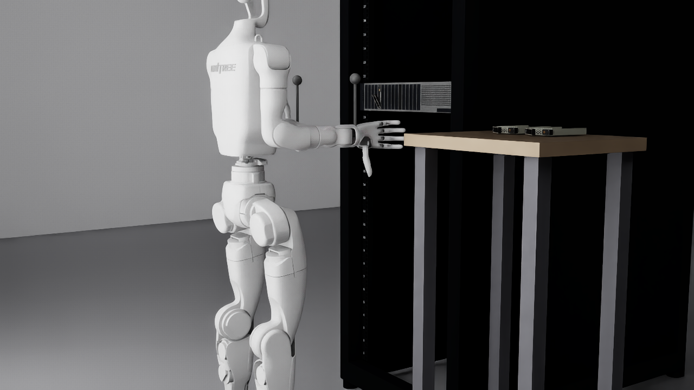

# G1 Server-Rack Manipulation (Isaac Sim)

A Unitree **G1 (29 DoF) with BrainCo Revo2 hands** stands at a **42U server rack**
holding a Dell PowerEdge R750 and services a hot-swap SSD: **press the release
button → draw the drive out partway → reseat it → re-lock the clasp.** It runs in
Isaac Sim 5.1 for **teleoperation, replay, and data generation**, and is the
first of a family of scenes that reuse the same robot + rack + server + SSD core
against swappable backgrounds.

- **Task id:** `Isaac-ServerRack-G129-Brainco-Joint`
- Built on the Unitree **`unitree_sim_isaaclab`** framework (upstream docs
  preserved in [`README_upstream.md`](README_upstream.md)).

<div align="center">
  
</div>

---

## Quick start — teleoperation

Everything below runs in the `unitree_sim_env` conda env (Isaac Sim 5.1 + torch);
the CycloneDDS + `unitree_sdk2py` stack and IsaacLab 2.3.2 source are already
installed (see [Environment](#environment)).

### 1. Start the simulation (this machine)
```bash
conda activate unitree_sim_env          # or use its python directly
cd /home/admin/isaac-sim/unitree_sim_isaaclab
source tools/teleop_env.sh              # sets LD_PRELOAD / CycloneDDS / PYTHONPATH

python sim_main.py --device cpu --enable_cameras \
  --task Isaac-ServerRack-G129-Brainco-Joint --robot_type g129 --enable_brainco_dds
```
This loads the scene, starts the **image server** (streams the head + wrist
cameras), and subscribes to robot/hand commands over **DDS domain 1**.

> `--device cpu` because torch in this env is the CPU build (the GPU still
> renders). Don't pass `--enable_inspire_dds` — this robot uses the **BrainCo**
> hand (`--enable_brainco_dds`).

Leave this terminal running. It's ready when the Isaac Sim window shows the G1 at
the rack and the console prints the DDS init lines.

### 2. Start the teleop client + Pico
Run your [`xr_teleoperate`](https://github.com/unitreerobotics/xr_teleoperate) on the
machine driving the Pico (may be this same machine), configured to match the sim:

- **DDS domain 1** — `ChannelFactoryInitialize(1)` (must equal the sim's).
- **image_server IP** = the sim machine — `127.0.0.1` if it's the same machine,
  otherwise its LAN IP (**this machine: `172.16.134.177`**).
- **robot** = G1, 29 DoF.
- It serves an HTTPS/WebXR page using the TLS cert already at
  `~/.config/xr_teleoperate/` (`cert.pem` / `key.pem`).

On the **Pico**: open the client page in the headset browser
(`https://<client-machine-ip>:<port>`), accept the certificate, and enter
immersive/VR mode.

### 3. Operate
- The **head-camera** view appears in the headset.
- Your **controllers/hands** drive the arm (IK → `rt/lowcmd`) and the BrainCo
  fingers (→ `rt/brainco/cmd`). Do the task: press the SSD release button, draw
  the drive out partway, reseat it, and re-lock the clasp.

### 4. Reset between attempts
Publish a reset on `rt/reset_pose/cmd` — from xr_teleoperate's reset control, or:
```bash
python send_commands_8bit.py    # gamepad; category 1 = reset the SSD, 2 = reset the whole scene
```

### 5. Record demonstrations
Live teleop demos are recorded by **`xr_teleoperate`** (into its own data dir). To
replay them in the sim and augment (vary lighting/cameras for more visual data):
```bash
python sim_main.py --device cpu --enable_cameras \
  --task Isaac-ServerRack-G129-Brainco-Joint --robot_type g129 --enable_brainco_dds \
  --replay --file_path <xr_teleoperate_data_dir> --generate_data --generate_data_dir ./data_serverrack
```

### BrainCo hand DDS contract (what the client must publish)
Defined in [`dds/brainco_dds.py`](dds/brainco_dds.py). Topic **`rt/brainco/cmd`**,
message `MotorCmds_`, **12 motors in radians** (`q`), left hand then right:

| idx | 0 | 1 | 2 | 3 | 4 | 5 | 6 | 7 | 8 | 9 | 10 | 11 |
|---|---|---|---|---|---|---|---|---|---|---|---|---|
| joint | L thumb_meta | L thumb_prox | L index | L middle | L ring | L pinky | R thumb_meta | R thumb_prox | R index | R middle | R ring | R pinky |

Only the **6 driven joints per hand** are sent; the 5 distal joints follow their
proximal automatically (thumb ×1.0, fingers ×1.155). State is published back on
`rt/brainco/state`.

> **Status:** the **sim side is fully wired and verified** (arm + BrainCo fingers,
> including finger coupling). Live finger motion just needs `xr_teleoperate` to
> publish to `rt/brainco/cmd` in the layout above. Until then, the **arm
> teleoperates**; fingers hold their open pose.

---

## Just want to look at it (no VR)
Opens the scene in the Isaac Sim GUI and gently waves the arm:
```bash
bash tools/run_server_rack_gui.sh          # add --still to hold the pose
```

*(Replay/augmentation details: [`README_upstream.md`](README_upstream.md) §2.4.3–2.4.4.)*

---

## Environment

Runs in the miniforge conda env **`unitree_sim_env`** (Python 3.11):
- **Isaac Sim 5.1** (pip `isaacsim[all]`) + **torch 2.7.0** (CPU) — pin
  `numpy==1.26.0` / `opencv-python==4.10.0.84` (the SDK/pinocchio try to pull
  numpy≥2, which breaks Isaac Sim).
- **IsaacLab 2.3.2** used via `PYTHONPATH` (source, not pip-installed).
- **Unitree DDS**: `cyclonedds==0.10.2` (bindings built against
  `/home/admin/isaac-sim/cyclonedds/install`) + editable `unitree_sdk2_python`.
- **`pin` + `pin-pink`** (the framework's task registry imports all tasks; some need it).

`source tools/teleop_env.sh` exports the `LD_PRELOAD` (libgomp), `CYCLONEDDS_HOME`,
`LD_LIBRARY_PATH`, and `PYTHONPATH` these require. Full notes in the project memory
and [`README_upstream.md`](README_upstream.md) (setup via `auto_setup_env.sh`).

---

## What's in the task

| Piece | Where | Notes |
|---|---|---|
| Registered task | [`tasks/g1_tasks/server_rack_g1_29dof_brainco/`](tasks/g1_tasks/server_rack_g1_29dof_brainco/) | env cfg + `gym.register` + mdp ([its README](tasks/g1_tasks/server_rack_g1_29dof_brainco/README.md)) |
| Scene core (swappable bg) | [`tasks/g1_server_rack/`](tasks/g1_server_rack/) | placements, environments, props ([its README](tasks/g1_server_rack/README.md)) |
| Scene base | `tasks/common_scene/base_scene_g1_server_rack.py` | room + rack + server + SSDs + object + world cam |
| BrainCo robot cfg | `robots/brainco.py` | Revo2 hand + finger coupling |
| BrainCo hand DDS | `dds/brainco_dds.py` | `rt/brainco/{cmd,state}` |
| Interactive SSD | `assets/objects/ssd_articulated/` | 5.1-native re-import (2 DOFs) via `tools/reimport_ssd_articulated_51.py` |
| Baked backdrop | `assets/environments/office_server_rack.usd` | from `tools/bake_environment_usd.py --env office` |

**4 cameras:** head D435 + left/right wrist (the 3 the recorder saves) + a fixed
3rd-person world cam.

**Swap the background** (future environments): add an `Environment` subclass in
`tasks/g1_server_rack/environments.py`, re-bake, done — the robot/rack/server/SSD
core is untouched.

---

## Known follow-ups
- **`xr_teleoperate` → `rt/brainco/cmd`**: publish the 12-motor BrainCo command to
  drive the fingers live (the sim side is ready).
- **SSD grasp/latch physics** (button stiffness, seated retention, grasp friction)
  are start values in `base_scene_g1_server_rack.py` — tune live during teleop.

---

*Upstream framework (all tasks, Docker, full setup, data pipeline): see
[`README_upstream.md`](README_upstream.md).*
